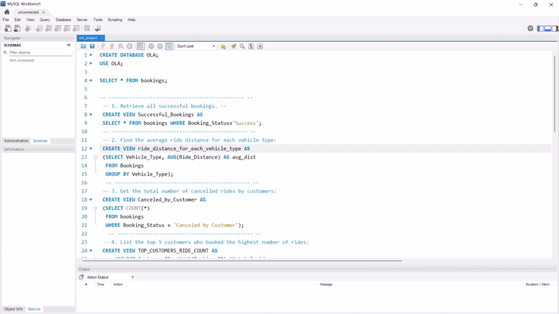

# 🚖 Ola Dashboard – SQL & Power BI Project  

## 📌 Project Overview  
This project demonstrates how **SQL** was used to answer **business questions** on Ola ride-hailing data, and how the results were transformed into an **interactive Power BI dashboard** for visualization.  



The aim was to explore booking performance, cancellation reasons, revenue patterns, and ratings to derive actionable insights.  

---

## 📂 Repository Structure  
Ola_Dashboard_Project :
- 📄 data.csv # Raw dataset
- 📄 business_queries.sql # SQL queries & views for business questions
- 📄 ola_dashboard.pbix # Power BI dashboard file
- 📄 ola_dashboard.pdf # Exported PDF of dashboard
- 📄 README.md # Project documentation

---

## 🛠️ SQL Business Questions & Answers  

### SQL Questions  
1. Retrieve all successful bookings  
2. Find the average ride distance for each vehicle type  
3. Get the total number of cancelled rides by customers  
4. List the top 5 customers who booked the highest number of rides  
5. Get the number of rides cancelled by drivers due to personal and car-related issues  
6. Find the maximum and minimum driver ratings for Prime Sedan bookings  
7. Retrieve all rides where payment was made using UPI  
8. Find the average customer rating per vehicle type  
9. Calculate the total booking value of rides completed successfully  
10. List all incomplete rides along with the reason  

### Example SQL Solutions  
```sql
-- 1. Retrieve all successful bookings
SELECT * 
FROM bookings 
WHERE Booking_Status = 'Success';

-- 2. Average ride distance per vehicle type
SELECT Vehicle_Type, 
       AVG(Ride_Distance) AS avg_distance
FROM bookings
GROUP BY Vehicle_Type;

-- 3. Total number of cancelled rides by customers
SELECT COUNT(*) 
FROM bookings 
WHERE Booking_Status = 'cancelled by Customer';

-- 4. Top 5 customers by ride count
SELECT Customer_ID, COUNT(Booking_ID) AS total_rides
FROM bookings
GROUP BY Customer_ID
ORDER BY total_rides DESC
LIMIT 5;
```
--- 

- The full .sql file also includes views for each business question (e.g., Successful_Bookings, Top_5_Customers, UPI_Payment) to modularize the workflow.

---

## 📊 Power BI Visualizations

### Questions Addressed in Power BI
- Ride Volume Over Time
- Booking Status Breakdown
- Top 5 Vehicle Types by Ride Distance
- Average Customer Ratings by Vehicle Type
- Cancelled Ride Reasons (Customer & Driver)
- Revenue by Payment Method
- Top 5 Customers by Total Booking Value
- Ride Distance Distribution per Day
- Driver Ratings Distribution
- Customer vs. Driver Ratings

### Dashboard Highlights (July 2024)
- Total Bookings: 103,024
- Succeeded Bookings: 63,967
- Cancelled Bookings: 28,933
- Total Booking Value: ₹35,080,467

#### Booking Status Breakdown
- Success → 62.09%
- Cancelled by Customer → 17.89%
- Cancelled by Driver → 10.19%
- Driver Not Found → 9.83%

#### Revenue by Payment Method
- Cash → ₹19.3M
- UPI → ₹14.2M
- Credit Card → ₹1.3M
- Debit Card → ₹0.3M

### Customer & Driver Insights
- Top 5 customers contributed ₹32,612
- Cancellation reasons:
  - Customers → Driver asked to cancel (30.24%), change of plans (19.82%), wrong address, etc.
  - Drivers → Customer-related issues (35.49%), personal/car issues, overcapacity, etc.
- Ratings: Both drivers & customers averaged ~4.0/5

### 📽️ Slides for Presentation
The slides folder contains 5 images summarizing:
- Ride volume
- Booking & cancellations
- Revenue insights
- Customer/driver behaviors
- Ratings comparison

### 🚀 How to Use
- Open `business_queries.sql` → explore SQL queries & views.
- Import the query outputs into Power BI.
- Open `ola_dashboard.pbix` → interact with the dashboard.
- For a static overview → check `ola_dashboard.pdf` or images in `slides/`.

### 💡 Key Learnings
- Structured business question answering with SQL.
- Designed interactive Power BI visuals for storytelling.
- Analyzed customer behavior, ride cancellations, and revenue distribution.
- Learned how to combine SQL logic with dashboard design for end-to-end analytics.

---